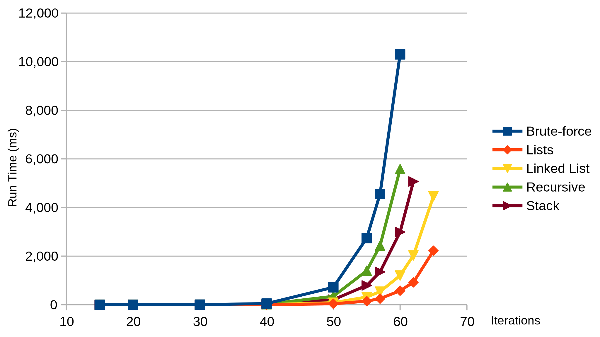
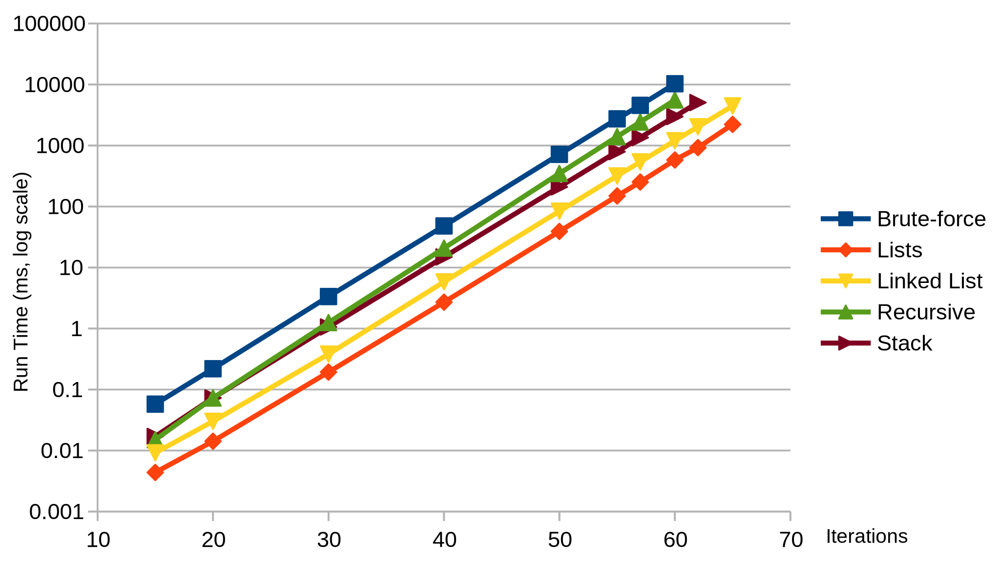

# A deep look into Look and Say

Xavier Villaneau — PyATL, Jan. 9<sup>th</sup> 2020

---

### The Look and Say sequence

1 <!-- .element: class="fragment" -->

11 <!-- .element: class="fragment" -->

21 <!-- .element: class="fragment" -->

1211 <!-- .element: class="fragment" -->

111221 <!-- .element: class="fragment" -->

312211 <!-- .element: class="fragment" -->

… <!-- .element: class="fragment" -->

---

### A few Python implementations

#### The classic one

```python
def look_and_say(string):
    result, previous, count = "", string[0], 1
    for char in string[1:]:
        if char != previous:
            result += str(count) + previous
            previous, count = char, 1
        else:
            count += 1

    result += str(count) + previous
    return result
```

+++

#### Alternative with `itertools`

```python
from itertools import groupby

def look_and_say(string):
    result = ""
    for char, grouper in groupby(string):
        result += str(sum(1 for _ in grouper)) + char
    return result
```

+++

#### Alternative with RegEx

```python
import re
RE_LNS = re.compile(r"((.)\2*)")

def look_and_say(string):
    result = ""
    for group, _ in RE_LNS.findall(string):
        result += str(len(group)) + group[0]
    return result
```

+++

### And the fastest is…

| Steps | Classic &#x1F389; | `groubpy` | RegEx  |
| ----- | ------- | --------- | ------ | 
| 10    | 14 μs   | 27 μs     | 25 μs  |
| 20    | 220 μs  | 350 μs    | 350 μs |
| 30    | 3.3 ms  | 5.1 ms    | 5.1 ms |
| 40    | 48 ms   | 79 ms     | 75 ms  |
| 50    | 0.7 s   | 1.2 s     | 1.1 s  |

---

### Where did it start?

https://adventofcode.com/2015/day/10

> Starting with the digits in your puzzle input, apply this process 40 times. **What is the length of the result**? 
>
> Now, […] apply this process 50 times <!-- .element: class="fragment" -->

---

## The Theory of Look and Say

This was studied in detail by John H. Conway in:


---

## The Splitting Theorem

+++

A 2-day-old string `LR` splits as `L.R` just if one of `L` and `R` is empty or `L` and `R` are of the types shown in one of:

| L   | R
|-----|---------------
| n]  | [m (n≥4, m≤3)
| 2]  | [1<sup>1</sup>X<sup>1</sup> \| [1<sup>3</sup> \| [3<sup>1</sup>X<sup>≠1</sup> \| [n<sup>1</sup> (n≥4)
| ≠2] | [2<sup>2</sup>1<sup>1</sup>X<sup>1</sup> \| [2<sup>2</sup>1<sup>3</sup> \| [2<sup>2</sup>3<sup>1</sup>X<sup>≠3</sup> \| [2<sup>2</sup>n<sup>(0,1)</sup> (n≥4)

+++

#### Splitting Example

    31133
    132.12.3
    111312.1112.13
    31131112.3112.1113
    1321133112.132112.3113
    11131.22.12.32112.1113122112.132113

+++

#### Implementation with RegEx

```regexp
# RE_END_SPLIT
[^2]22$
```

and

```regexp
# RE_SPLITS
21([^1])(?!\1)
2111[^1]
23(?:$|([^3]){1,2}(?!\1))
2([^123])(?!\1)
[^123][123]
```

+++

#### The code

```python
def _split(string):
    if RE_END_SPLIT.search(string):
        yield from _split(string[:-2])
        yield "22"
        return 
    for regex in RE_SPLITS:
        if match := regex.search(string):
            p = match.start() + 1
            yield from _split(string[:p])
            yield from _split(string[p:])
            return
    yield string  # No matches
```

+++

**IMPORTANT**: Split can only be applied after 2 steps!

4.1111 → 14.4.1 → 1114.14.11  ✗

41111 → 1441 → 112.4.11  ✓

---

### Split put in practice

Let's memoize it, because why not.

```python
from functools import lru_cache

def split(string: str) -> List[str]:
    return list(_split(string))

@lru_cache(maxsize=128)
def look_say_split(string: str) -> List[str]:
    return split(look_and_say(string))
```

+++

#### Implementation

```python
def list_deep_lns(string: str, depth: int):
    if depth <= 0:
        return [string]
    atoms = [look_and_say(string)]
    for _ in range(depth - 1):
        next_atoms = []
        for string in atoms:
            next_atoms += look_say_split(string)
        atoms = next_atoms
    return atoms
```

+++



15× faster! Such wow!

+++



…but we're still _O(e<sup>n</sup>)_

+++

### Experimental observations

Observed exponent factor: 1.304527

Conway's constant: λ = 1.303577269034…  <!-- .element: class="fragment" -->

  <!-- .element: class="fragment" -->

---

### Our progress so far

Runtime for the Advent of Code puzzle:  
3 seconds → 200 milliseconds

…but we can do better!

+++

Transform "1" 20 times…

```
3113112221131112311332111213122112311311123112111331121113122112
1321131211132221123113112221131112212211131221121321131211132221
1213211321322113311213212322211231131122211311123113223112111311
2221121321133112132112211213322112111312211312111322212321121113
1211121311121321123113213221121113122123211211131221121311121312
2112132113213221123113112221131112311311121321122112132231121113
122113322113111221131221
```

+++

…split it…

```
3113112221131112.311332.1112.13122112.31131112.3112.11133112.111
3122112.13211312.1113222112.311311222113111221.22.1113122112.132
11312.1113222112.1321132.13221133112.132.123222112.3113112221131
112.3113.22.3112.111311222112.1321133112.132112211213322112.1113
12211312.1113222.12.32112.111312.1112.131112.132112.31132.132211
2.11131.22.12.32112.1113122112.131112.13122112.1321132.1322112.3
113112221131112.31131112.1321122112.13.22.3112.11131221133221131
11221131221
```

+++

… and count the split bits:

```
4×  22
3×  3112 1113122112 3113112221131112
2×  12 1112 32112 131112 1321132 1322112 13122112
    13211312 31131112 1113222112
1×  13 132 3113 31132 11131 311332 111312 132112
    1113222 11133112 123222112 1321133112 1321122112
    13221133112 111311222112 111312211312
    311311222113111221 132112211213322112
    1113122113322113111221131221
```

More iterations ⇒ More repeated strings  <!-- .element: class="fragment" -->

---

## The Chemistry

Conway identified **92 strings** ("atoms" or "elements") that are the descendents of **every string**.

He named every one of them after the elements from the Periodic Table.  <!-- .element: class="fragment" -->

+++

| Element         | String          | Description
| --------------- | --------------- | -----
|  U<sub>92</sub> | 3               | Pa<sub>91</sub>
| Pa<sub>91</sub> | 13              | Th<sub>90</sub>
| Th<sub>90</sub> | 1113            | Ac<sub>89</sub>
| Ac<sub>89</sub> | 3113            | Ra<sub>88</sub>
| Ra<sub>88</sub> | 132113          | Fr<sub>87</sub>
| Fr<sub>87</sub> | 1113122113      | Rn<sub>86</sub>
| Rn<sub>86</sub> | 311311222113    | Ho<sub>67</sub>At<sub>85</sub>
| At<sub>85</sub> | 1322113         | Po<sub>84</sub>

+++

### The Chemical Theorem

1. The descendents of any of the 92 elements in our Periodic Table are compounds of those elements.
2. All sufficiently late descendents of any of these elements other than Hydrogen ("22") involve **all** of the 92 elements simultaneously.
3. The descendents of **any string** other than "" (empty string) or "22" also ultimately involve **all** of those 92 elements simultaneously.

+++

### The Transuranic elements

For each n ≥ 4, we define two particular atoms:

- an isotope of **Plutonium** (Pu):  
`31221132221222112112322211n`
- an isotope of **Neptunium** (Np):  
`1311222113321132211221121332211n`

---

## The Cosmological Theorem

**Any** string decays into a compound of common and transuranic elements after a **bounded** number of derivation steps. […]

+++

```
312211322212221121123222113                  27
13112221133211322112211213322113             32
11132.13.22.12.312211322212221121123222113   38
311312.1113.22.1112.[32]                     48
1321131112.3113.22.3112.[38]                 58
11131221133112.132113.22.132112.[48]         76
```