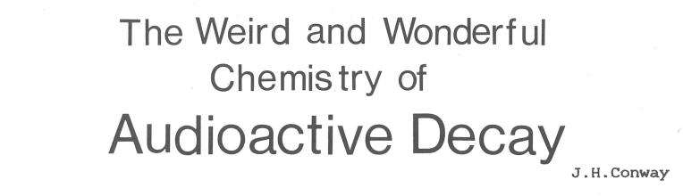

# A deep look into Look and Say

Xavier Villaneau — PyATL, Jan. 9<sup>th</sup> 2020

---

### The Look and Say sequence

1 <!-- .element: class="fragment" -->

11 <!-- .element: class="fragment" -->

21 <!-- .element: class="fragment" -->

1211 <!-- .element: class="fragment" -->

111221 <!-- .element: class="fragment" -->

312211 <!-- .element: class="fragment" -->

… <!-- .element: class="fragment" -->

---

### A few Python implementations

#### The classic one

```python
def look_and_say(string):
    result, previous, count = "", string[0], 1
    for char in string[1:]:
        if char != previous:
            result += str(count) + previous
            previous, count = char, 1
        else:
            count += 1

    result += str(count) + previous
    return result
```

+++

#### Alternative with `itertools`

```python
from itertools import groupby

def look_and_say(string):
    result = ""
    for char, grouper in groupby(string):
        result += str(sum(1 for _ in grouper)) + char
    return result
```

+++

#### Alternative with RegEx

```python
import re
RE_LNS = re.compile(r"((.)\2*)")

def look_and_say(string):
    result = ""
    for group, _ in RE_LNS.findall(string):
        result += str(len(group)) + group[0]
    return result
```

+++

### And the fastest is…

| Steps | Classic &#x1F389; | `groubpy` | RegEx  |
| ----- | ------- | --------- | ------ | 
| 10    | 14 μs   | 27 μs     | 25 μs  |
| 20    | 220 μs  | 350 μs    | 350 μs |
| 30    | 3.3 ms  | 5.1 ms    | 5.1 ms |
| 40    | 48 ms   | 79 ms     | 75 ms  |
| 50    | 0.7 s   | 1.2 s     | 1.1 s  |

---

### Where did it start?

https://adventofcode.com/2015/day/10

> Starting with the digits in your puzzle input, apply this process 40 times. **What is the length of the result**? 
>
> Now, […] apply this process 50 times <!-- .element: class="fragment" -->

---

## The Theory of Look and Say

This was studied in detail by John H. Conway in:



---

### The Splitting Theorem

A 2-day-old string `LR` splits as `L.R` just if one of `L` and `R` is empty or `L` and `R` are of the types shown in one of:

| L   | R
|-----|---------------
| n]  | [m (n≥4, m≤3)
| 2]  | [1<sup>1</sup>X<sup>1</sup> \| [1<sup>3</sup> \| [3<sup>1</sup>X<sup>≠1</sup> \| [n<sup>1</sup> (n≥4)
| ≠2] | [2<sup>2</sup>1<sup>1</sup>X<sup>1</sup> \| [2<sup>2</sup>1<sup>3</sup> \| [2<sup>2</sup>3<sup>1</sup>X<sup>≠1</sup> \| [2<sup>2</sup>n<sup>(0,1)</sup> (n≥4)

+++

#### Splitting Example

    31133
    132.12.3
    111312.1112.13
    31131112.3112.1113
    1321133112.132112.3113
    11131.22.12.32112.1113122112.132113

+++

#### Implementation with RegEx

```regexp
# RE_END_SPLIT
[^2]22$
```

and

```regexp
# RE_SPLITS
21([^1])(?!\1)
2111[^1]
23(?:$|([^3]){1,2}(?!\1))
2([^123])(?!\1)
[^123][123]
```

+++

#### The code

```python
def _split(string):
    if RE_END_SPLIT.search(string):
        yield from _split(string[:-2])
        yield "22"
    else:
        for regex in RE_SPLITS:
            if match := regex.search(string):
                p = match.start() + 1
                yield from _split(string[:p])
                yield from _split(string[p:])
                return
        yield string  # No matches
```

+++

**IMPORTANT**: Split can only be applied after 2 steps!

4.1111 → 14.4.1 → 1114.14.11  ✗

41111 → 1441 → 112.4.11  ✓
